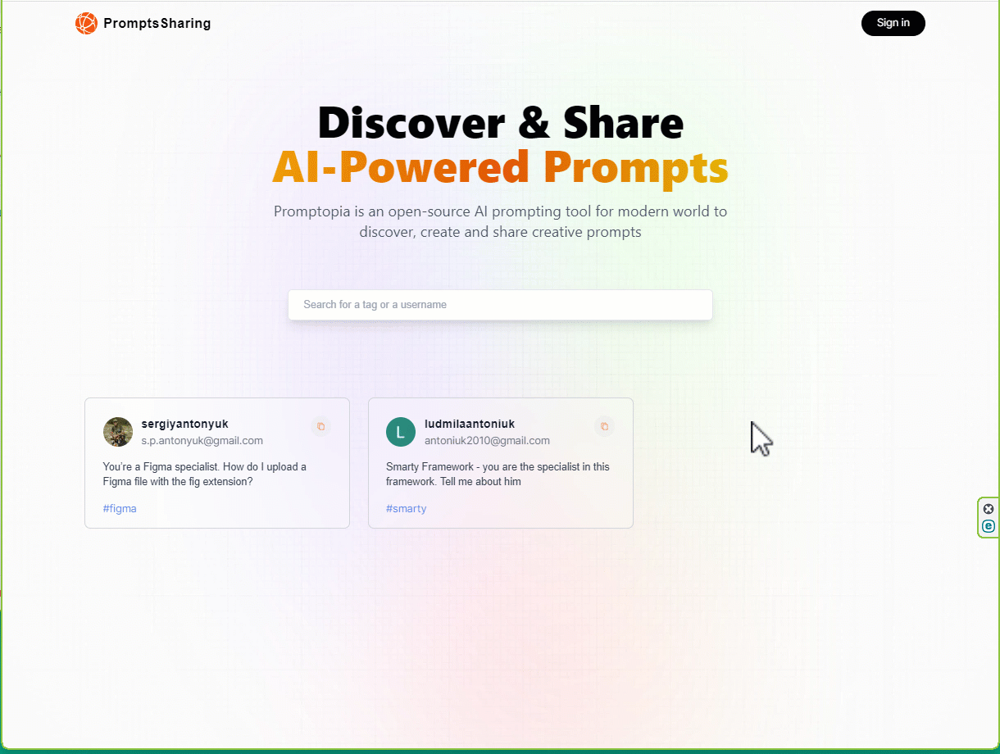

## AI Prompts Sharing - online free SaaS

### Next.js is official React framework as outlined in React docs. 
This application demonstrates important Next.js 13 concepts and how they fit into the React ecosystem. 

### App based on using Next.js 13,  MongoDB, Tailwind, Vercel, next-auth

#### [Next.js](https://nextjs.org/docs)  

Next.js enables you to create full-stack Web applications by extending the latest React features, and integrating powerful Rust-based JavaScript tooling for the fastest builds

#### [Tailwind CSS](https://tailwindcss.com/)

A utility-first CSS framework packed with classes like flex, pt-4, text-center and rotate-90 that can be composed to build any design, directly in your markup

#### [MongoDB](https://www.mongodb.com/)

The developer data platform that provides the services and tools necessary to build distributed applications fast, at the performance and scale users demand

#### [mongoose](https://mongoosejs.com/)

Elegant mongodb object modeling for node.js

#### [next-auth](https://next-auth.js.org/)

Authentication for Next.js

#### [Vercel](https://vercel.com/) 

Vercel is the platform for frontend developers, providing the speed and reliability innovators need to create at the moment of inspiration

[GitHub](https://github.com/sxidsvit/) - my GitHub repository 

[Visit site](https://ai-prompts-sharing.vercel.app/)

---

### How does this work

##### Contact with me: 
[][linkedin]

[linkedin]: https://www.linkedin.com/in/sergiy-antonyuk/